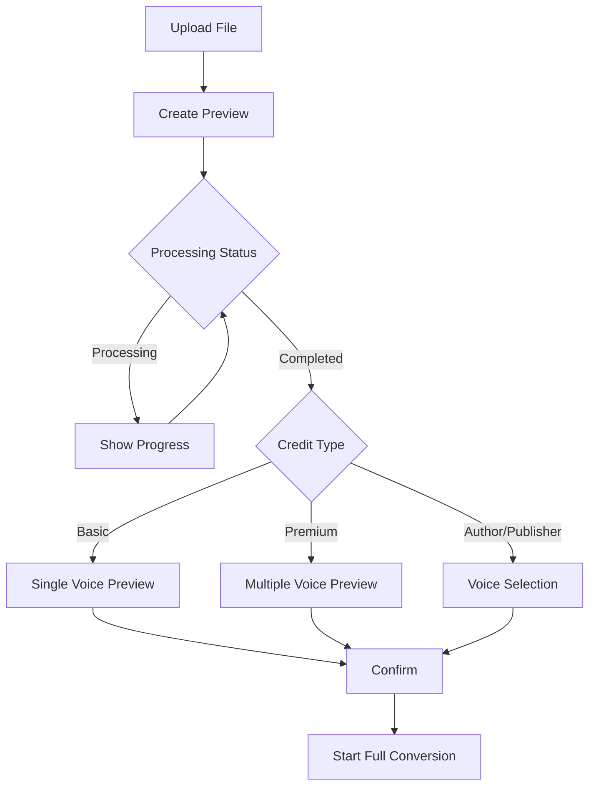

# Audiobook Preview Feature - Quick Reference

## 📋 Overview

A comprehensive UI system for previewing TTS-generated audiobooks after upload, supporting three credit tiers with distinct experiences.

## 🚀 Quick Start

### Access the Preview Page
```
URL: /preview/{previewId}
Example: /preview/abc123
```

### From Upload Page
```typescript
navigate(`/preview/${previewId}`);
```

## 📁 File Structure

```
frontend/src/
├── types/preview.ts                      # TypeScript definitions
├── components/audiobook/
│   ├── ProcessingStatus.tsx              # Upload/processing feedback
│   ├── VoicePreview.tsx                  # Audio player component
│   └── VoiceSelector.tsx                 # Voice selection dropdown
├── pages/AudiobookPreview.tsx            # Main preview page
└── components/ui/
    ├── alert.tsx                         # Alert component (new)
    ├── select.tsx                        # Select dropdown (new)
    └── tabs.tsx                          # Tabs component (new)
```

## 🎨 Credit Types

### 1. Basic Credit
- **Icon:** BookOpen (blue)
- **Features:** Single voice preview
- **UI:** Simple audio player
- **Flow:** Upload → Process → Preview → Confirm

### 2. Premium Credit
- **Icon:** Sparkles (purple)
- **Features:** Multiple character voices
- **UI:** Grid of character previews with "Theatrical" badges
- **Flow:** Upload → Process → Preview characters → Confirm

### 3. Author/Publisher
- **Icon:** Users (blue)
- **Features:** Custom voice selection per character
- **UI:** Dropdown selectors with live preview
- **Flow:** Upload → Process → Select voices → Preview → Confirm

## 🔌 API Endpoints

| Endpoint | Method | Purpose |
|----------|--------|---------|
| `/api/previews` | POST | Create preview |
| `/api/previews/{id}` | GET | Get preview data |
| `/api/previews/{id}/status` | GET | Poll processing status |
| `/api/previews/{id}/character-voices` | PUT | Update voice selection |
| `/api/previews/{id}/confirm` | POST | Start full conversion |
| `/api/voices/available` | GET | List voice options |

## 🎯 Key Components

### ProcessingStatus
Shows upload and TTS processing progress with:
- Visual status indicators
- Progress bar (0-100%)
- Estimated completion time
- Error messages

### VoicePreview
Custom audio player with:
- Play/pause controls
- Timeline/progress bar
- Time display
- Character information
- Theatrical badges

### VoiceSelector
Voice selection interface with:
- Character info display
- Voice dropdown menu
- Live preview player
- Visual feedback

## 💾 Data Types

### AudioPreview
```typescript
{
  id: string;
  creditType: 'basic' | 'premium' | 'author_publisher';
  processingStatus: 'uploading' | 'processing' | 'completed' | 'failed';
  processingProgress?: number;
  basicVoicePreviewUrl?: string;
  characterVoices?: CharacterVoice[];
  availableVoices?: VoiceOption[];
}
```

### VoiceOption
```typescript
{
  id: string;
  name: string;
  description: string;
  gender: 'male' | 'female' | 'neutral';
  accent: string;
  sampleUrl: string;
}
```

## 🎬 User Flow



## 🎨 Design System

### Colors
- **Basic:** Blue (#3B82F6)
- **Premium:** Purple (#9333EA)
- **Author/Publisher:** Blue (#0EA5E9)

### Icons (lucide-react)
- BookOpen, Sparkles, Users
- Play, Pause, Loader2
- CheckCircle2, XCircle
- ArrowLeft, ChevronDown

### Spacing
- Page padding: 32px
- Card padding: 16px
- Component gap: 16px
- Section gap: 24px

## 🔄 Status Polling

The page automatically polls for status updates every 3 seconds while processing:

```typescript
useEffect(() => {
  const pollInterval = setInterval(async () => {
    const status = await fetchStatus(previewId);
    updatePreviewStatus(status);
  }, 3000);
  
  return () => clearInterval(pollInterval);
}, [previewId]);
```

## ✅ Backend Integration Checklist

- [ ] Create preview endpoint (`POST /api/previews`)
- [ ] Get preview data endpoint (`GET /api/previews/{id}`)
- [ ] Status polling endpoint (`GET /api/previews/{id}/status`)
- [ ] Update character voices (`PUT /api/previews/{id}/character-voices`)
- [ ] Confirm conversion (`POST /api/previews/{id}/confirm`)
- [ ] List available voices (`GET /api/voices/available`)
- [ ] TTS processing job queue
- [ ] Audio file storage and CORS
- [ ] Character detection algorithm
- [ ] Voice assignment logic

## 🧪 Testing Checklist

- [ ] All three credit types render correctly
- [ ] Status polling updates in real-time
- [ ] Audio playback works across browsers
- [ ] Voice selection updates preview
- [ ] Error states display properly
- [ ] Mobile responsive design
- [ ] Keyboard navigation works
- [ ] Screen reader compatibility
- [ ] Loading states display
- [ ] Network error handling

## 📱 Responsive Design

### Mobile (<640px)
- Single column layout
- Stacked buttons
- Full-width cards

### Tablet (640-1024px)
- Two column grid for previews
- Adjusted spacing

### Desktop (>1024px)
- Full grid layout
- Optimal spacing
- Side-by-side comparisons

## 🐛 Common Issues

### Audio Not Playing
- Check CORS configuration
- Verify audio URL is accessible
- Check browser console for errors

### Status Not Updating
- Verify polling interval is active
- Check API endpoint returns correct data
- Ensure preview ID is valid

### Voice Selection Not Saving
- Check PUT endpoint is called
- Verify request body format
- Check backend updates database

## 📚 Documentation

- **Full Feature Docs:** `AUDIOBOOK_PREVIEW_UI.md`
- **Integration Guide:** `PREVIEW_INTEGRATION_GUIDE.md`
- **Design Specs:** `PREVIEW_UI_DESIGN_SPECS.md`

## 🤝 Contributing

When modifying this feature:
1. Update TypeScript types in `types/preview.ts`
2. Add backend integration comments
3. Test all three credit types
4. Update documentation
5. Check responsive design

## 📞 Support

For questions or issues:
- Review inline code comments
- Check documentation files
- Verify API endpoint responses
- Test in different browsers

---

**Version:** 1.0  
**Last Updated:** December 11, 2025  
**Status:** Ready for Integration
